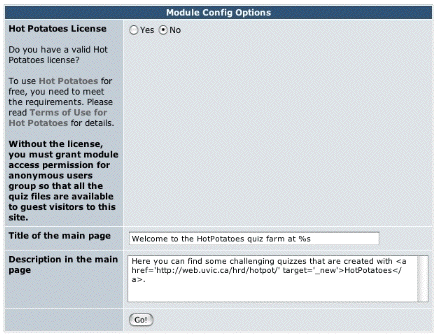

# 3.0 Preferences
Preferences can be set by the site admin users. The module admins (users given admin permission for paricular modules) can not change the preference settings.

The first item in the preferences section is the setting of the Hot Potatoes license. If you have a valid license of the software, check Yes in this section. By setting this to Yes, you will be able to publish quizzes that are not open to the public. To look at it another way, if your license setting is No, anonymous users will be able to access your XoopsHP module automatically even if guest access is turned off in the system preference, in order to ensure that unlicensed quizzes are freely available to anyone on the web.

You can also change the title and the brief description in the top page of the module.

