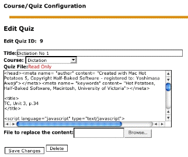

# 4.0 Operating Instructions

##Adding quizzes
###Preparing quiz files
Use the latest version of Hot Potatoes and create quiz files. For details, please read the tutorial available at Hot Potatoes homepage (http://web.uvic.ca/hrd/hotpot/tutorials6.htm).

The module tries to alter the source of the quiz file during the upload process so that the CGI option is enabled, regardless of how the quiz was created. However, it heavily relies on subtle matching of the text strings, so it is recommended to have the CGI option turned on when you create the quiz. In that case, you do not need to set anything in the fields of the CGI option.

###Supported format of quiz files
XoopsHP is compatible with all the quiz types provided by Hot Potatoes ver. 6: JCloze, JCross, JMix, JMatch, JQuiz. The drag and drop types of quizzes are also supported.

Since quiz files created by older versions of Hot Potatoes may have slightly different structures in their source code, this module can not guarrantee the automatic implementation of the feedback CGI functions properly. As far as the author quickly investigated, sometimes the user ID prompt appears more than once, but this does not affect the feedback feature as a whole.

###Images, audio, and other recourses
In this module, only the text source file can be uploaded and stored in the database. In order to publish quizzes with other multimedia content such as images and audio files, you first need to upload them somewhere on the web. Then, when you incorporate those objects in your quizzes, be sure to refer to them by complete URLs, that is, starting from http://. Likewise, if you want to nclude any links in the quiz, use full URLs.

###Add Quiz

Uploading the quiz file

In the Manage Quizzes section, type the title of the quiz and select the course it belongs to. Then, specify the quiz file to upload from your hard disk. Press the Add Quiz button. If successful, the quiz will be listed in the quiz list section in the admin menu, as well as in the quiz list for users.

###Updating the quiz

Preferences

Go into the edit quiz mode from where the Edit link is available. You can directly edit the title and select a new course, but you cannot edit the content of the quiz source even though it is displayed in the text area for your reference. To replace the quiz content, prepare a new quiz file first, and upload the file to substitute for the existing content.