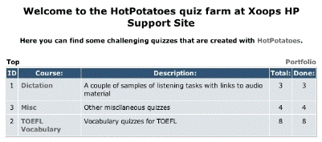
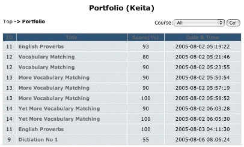
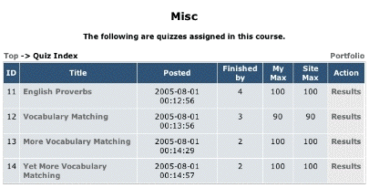
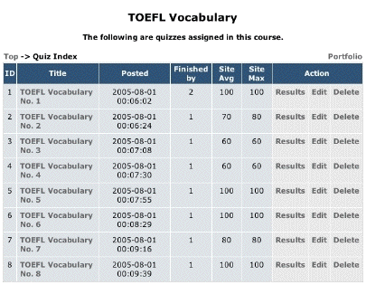
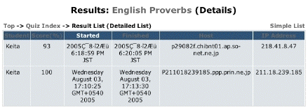
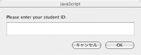
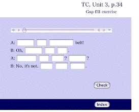
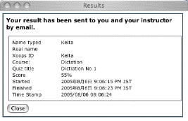

# 5.0 The User Side

##Top Page

*Figure #: Course List (User side)*

In the top page of the module, you will see a list of available courses with their brief descriptions, along with the number of quizzes you have already finished and the total number of available quizzes in each course. If you are a module admin, you will see the number of quizzes at least one student has finished in each course instead.

The course titles are linked to the quiz lists, where users can click the title of the quiz and start the quiz.

###Portolio
Unless you are a guest user, you see a link to your portfolio section at the top right of the course list table. For users, all the past records will be listed in the portfolio, and for admin users, all the records of all the users will be displayed. The quiz title is linked to the corresponding quiz so that users can jump directly to the quiz from the list.

*Figure #: User Portfolio (User side)* 

You can specify a particular course to display results from, and you can sort the record items by clicking the heading in the table.

Admin users can delete record items in the list by clicking the delete button right next to the items.

*Figure #: User Portfolio (Admin side)*

##Quiz List
Quiz ID, title, date and time the quiz was posted, the number of students who finished the quiz, the highest scores of the user and all the users are displayed in the quiz list. If a user has finished a particular quiz at least once, a Result link will be shown in the action column, which will show all the records of the student related to the quiz.

*Figure #: Quiz List (User side)* 

The portfolio link in this section will conveniently takes uses to the list of their records of this particular course.

The admin users additionally see Edit and Delete buttons for each quiz, so that they can replace the quiz content or delete the quiz with all its user records. The result button for the admins will display all the records of all the users for the particular quiz.

*Figure #: Quiz List (Admin side)

###Results View

In the result view, there are two display modes: simple view with only basic information, and detailed view with more information such as users' host and IP addresses, etc. Display order can be changed by clicking the header items of the table.

For admin users, a delete button is displayed for each entry in the result list so that they can remove unnecessary entries from the database.

##Taking a quiz
###Starting a quiz
Users can start a quiz by clicking quiz titles in the quiz list or elsewhere such as the header in the result view etc. Guest users, those who haven't logged in to the site, are prompted with an alert that their result will not be recorded in the database nor sent by email.

###ID prompt

Users are then prompted to enter their ID (or names, etc depending on the setting when the quiz was created). This is redundant information because the site username is automatically recorded with the results, but teachers can instruct their students to type some other information as necessary. The quiz will not start properly without typing some text at the prompt.

###Hint button

*Figure #: Sample Quiz*

If the quiz was created with the hint feature enabled, a hint button will be displayed. By clicking the button, one letter will be given as a hint in the focused blank in quizzes of the cloze type. Uses of the hint button reduces the final score at the end.

###Checking answers
Users can check their answers any time during the attempt. The total score is reduced according to the frequency of answer checking. The perfect answer in the very first check results in a score of 100%. Correct answers will be marked in bold or with some distinct marks, while wrong answers remain for correction. The result of the quiz will not be sent until the user completes the quiz by giving all the right answers.

###Feedback of the result

*Figure #: Feedback*

A new window will pop open when the quiz is done, and the score of the quiz is displayed in the new window along with other information. At this point, the same information is recorded in the database and is sent by email to the registered addresses of the poster and the taker of the quiz.

At the bottom of the window, there is a Close button to close both the quiz and the result window at once.

[IMPORTANT] Users must allow their WWW browsers to use pop-up windows. Otherwise the results will not be displayed, recorded nor sent properly.

###Navigating among blanks
When filling in blanks in the cloze type quiz, a tab key will move the position of the cursor to the next blank, while shift+tab will move the focus back to the one before the current one. The exiisting answer will be selected right after the movement with the tab key, the user can either start typing a new answer by replacing the old one, or first unselect the old answer by typing a right cursor key before adding new text.